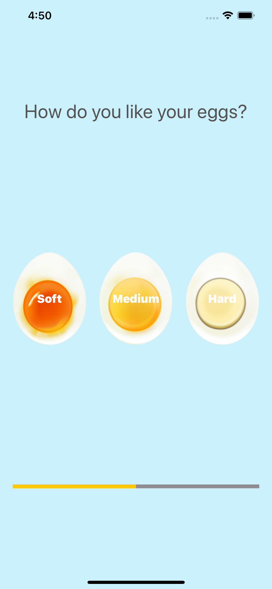
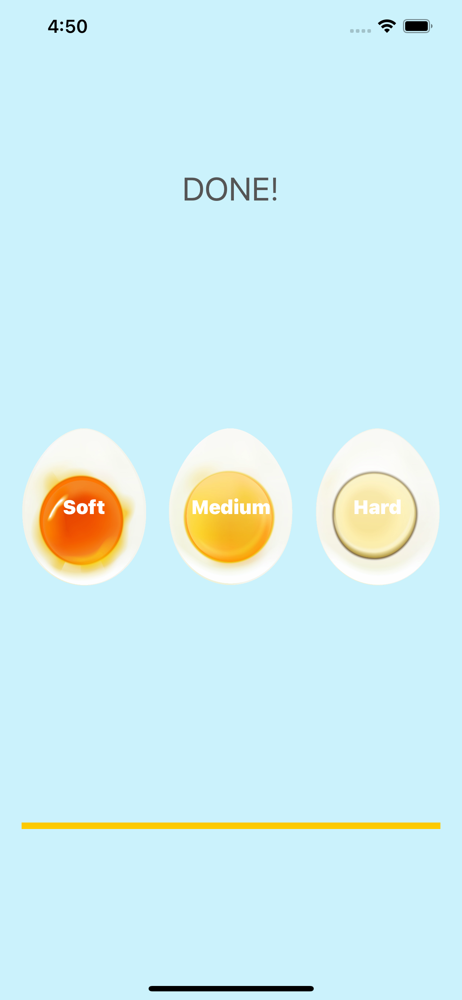

# Egg Timer App using Swift

This is a simple app that can help you cook your egg to perfection based on how you like it. I built this to learn the basics of swift. How to play audio, How to update timer and How to Update text on the screen.

### #ScreenShot 1
</img>

### #ScreenShot 2
</img>